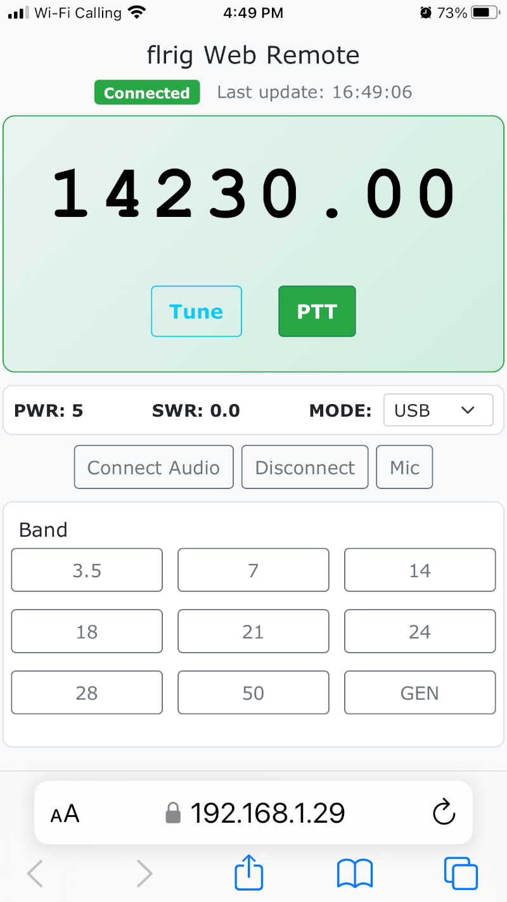
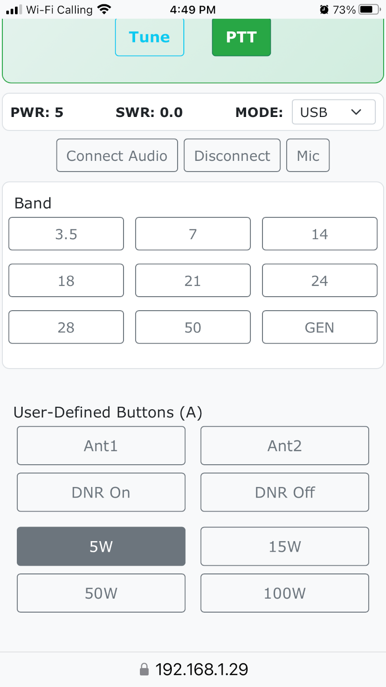

# flrigWebRemote-server.py

Run this on the same machine as flrig that is controlling your radio.

Alternately, if you have flrig set up to bind to an IP address that can be reached from another
host on your LAN, you can run it on a different machine. (Using the alternate branch, I've run
this on my Mac, remotely controling the Linux box that runs flrig. In so doing, I've goten even
clearer audio, plus TX audio from the iPhone mic, with pretty low latency.)

Find the LAN IP address of the host running this python app.

On your iPhone/iPad/whatever, browse to {python-app-IP}:5000

And lookie there... you have a web remote display for your station.

Now, if **you** want to experiment with also sending your iOS device microphone audio to the
radio, that requires more. Your little web app needs to run HTTPS, which means making yourself
a self-signed CA, and a server certificate. That's beyond the scope of this README. Point being,
the "Mic" button will ask you for permission to use your microphone. That can only happen in a
"secure" context... i.e. over https.

I've done the cert thing. Sent the CA to the iOS device using AirDrop, which becomes an installable
"Profile" within iOS Settings, in the VPN & whatnot section. But I haven't (yet) gotten the TX
audio to work well... only a little. And the latency gradually increases, pretty quickly becoming
too slow to be viable for a conversation.

**Therefore** what I did instead for TX audio was to shut off my APRS station, instead using that
2-meter transceiver on a Simplex frequency, and transmit to it from an HT in the shed. The speaker
out of the 2-meter rig plugged into the Line In of the HF rig, and the HF rig had VOX turned on. I'd
operated cross-band like this before, but what wasn't so smooth was the controlling of the HF radio.
Was using one or another remote-screen-control software (AnyDesk, TeamViewer, et al). The problem
with that is that trying to control flrig that way is... ooky. So this web app simplifies a lot of
this, because I have complete control over the layout and size of various elements.

I'm absolutely chuffed with how well the RX audio is over the Opus WebRTC codec.

Here's what the screen looks on iPhone, presently...

